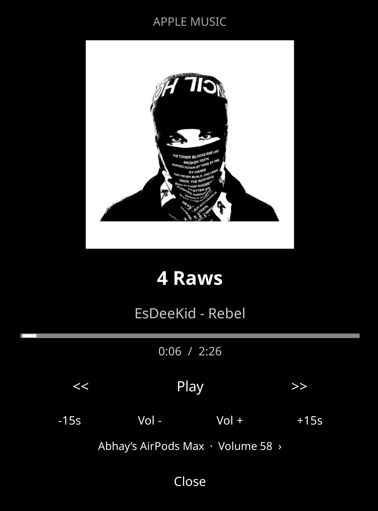

# kindledock

Turn a jailbroken Kindle into an always-on now-playing display and remote control for the music playing on your Mac.



## What it does

- Controls whatever your Mac is playing - Apple Music, Spotify, YouTube, Netflix, anything the macOS now-playing system can see
- Shows it on a clean e-ink UI that looks native to the device: track, artist, and art (square album covers for music, 16:9 thumbnails for video)
- Dark and light themes, flat text controls, hairline progress - no phone UI glued onto e-ink
- Controls playback from the Kindle: play/pause, next/previous, ±15s, volume, and tap anywhere on the progress bar to seek
- Switches the Mac's sound output from the Kindle: tap the output line to move audio between speakers, headphones, AirPods, or any other output device (AirPlay targets such as TVs are not listed; macOS does not expose them as audio devices)
- Shows a large clock when nothing is playing, so an idle dock is still useful
- Runs as a KOReader plugin: open it from Tools > More tools > Now Playing, or bind a gesture (e.g. swipe right along the top edge) to open it anywhere
- Zero-touch: the Mac daemon starts at login (launchd), KOReader starts at boot on the Kindle, and the two reconnect on their own over your LAN or Tailscale
- The Kindle never sleeps while docked, so it's always reachable and always showing the current track

The Kindle is a display and remote only - audio keeps playing on the Mac.

## How it works

```
kindledock.koplugin (KOReader, on the Kindle)
        |  HTTP GET  /nowplaying  (poll every 3s)
        |  HTTP GET  /outputs     (sound output list)
        |  HTTP POST /cmd?c=...   (play/pause/seek/volume/output)
        v
kindledockd.py (launchd agent, port 8931, on the Mac)
        |  media-control          (now-playing state + transport, system-wide)
        |  CoreAudio via ctypes   (sound output list and switching)
        |  AppleScript            (volume, browser ±15s)
```

The daemon bears a token (auto-generated on first run, `~/.config/kindledock/config.json`); the plugin presents it on every request. Both devices just need to reach each other - same LAN, or Tailscale if your LAN is CGNAT or you want it to work away from home.

## Setup

The full end-to-end setup - written so a coding agent can do it for you - is in [AGENTS.md](AGENTS.md).

## Docs

- [docs/sleep-wake.md](docs/sleep-wake.md) - research on Kindle sleep/wake behavior, boot persistence, and prior art in this space

## Requirements

- A jailbroken Kindle with [KOReader](https://github.com/koreader/koreader) installed
- A Mac (the daemon uses macOS media APIs and AppleScript)

## License

MIT - see [LICENSE](LICENSE).
